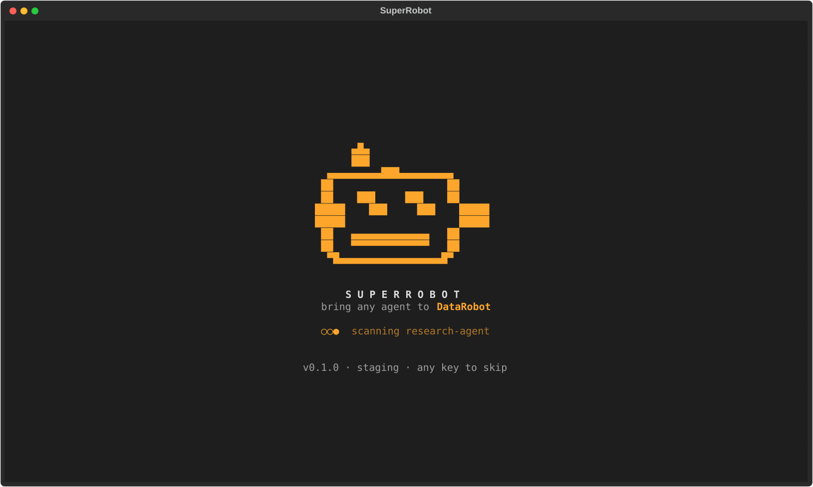
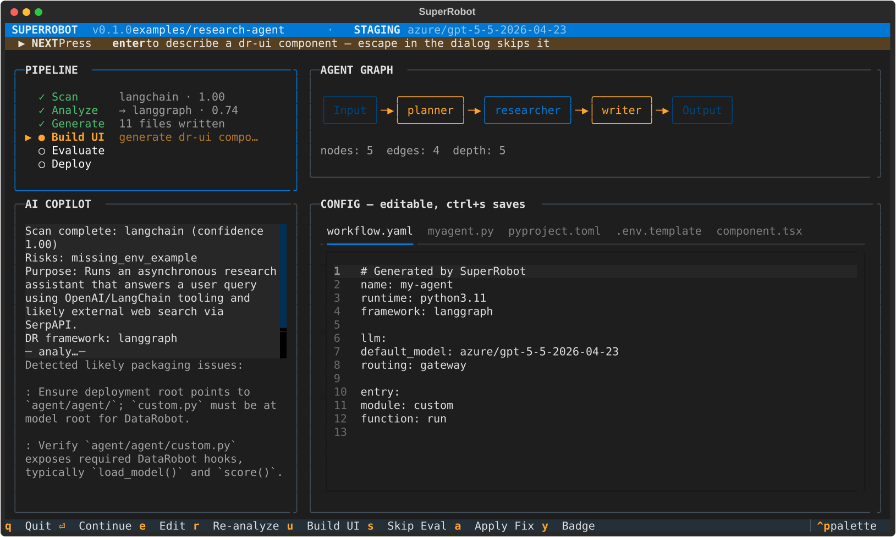

<div align="center">

# 🤖 SuperRobot

### Bring any Python agent to DataRobot — without rebuilding it from scratch.

[](https://www.python.org/downloads/)
[](https://textual.textualize.io/)
[](https://github.com/astral-sh/ruff)
[](https://mypy-lang.org/)
[](#development)

*A TUI-powered CLI that migrates existing LangChain / LangGraph / LlamaIndex / CrewAI / Pydantic AI agents to DataRobot — automating the entire brownfield deployment path that no existing tool covers.*



</div>

---

## Table of Contents

- [The Problem](#the-problem)
- [What SuperRobot Does](#what-superrobot-does)
- [Quick Start](#quick-start)
- [The Import Pipeline](#the-import-pipeline)
- [Superpowers](#superpowers)
- [Three Modes](#three-modes)
- [Architecture](#architecture)
- [Encoded DataRobot Platform Rules](#encoded-datarobot-platform-rules)
- [Command Reference](#command-reference)
- [Development](#development)
- [Scope & Non-Goals](#scope--non-goals)

---

## The Problem

DataRobot has great tooling for **greenfield** agents — start from a DR template, and the `dr`
CLI and Agent Assist take you the rest of the way. But if you already have a **working agent
somewhere else** (a LangGraph research agent, a CrewAI crew, a raw async pipeline), there is
**no migration path**. To get it onto DataRobot today you must, by hand:

1. Clone a DR agent template and study its layout
2. Rewrite your agent to extend a DR base class (`LangGraphAgent`, `CrewAIAgent`, …)
3. Restructure code into the `agent/agent/` DRUM bundle layout
4. Wire `custom.py` with the correct `_RUNTIME_PARAM_KEYS`
5. Configure `workflow.yaml` for LLM routing
6. Write Pulumi `infra/` scripts for every cloud resource
7. Register every runtime parameter in **three separate places** — miss one and it fails *silently* at runtime
8. Move hardcoded prompts to the Prompt Management Registry
9. Audit every import — DRUM flattens the bundle, so `from agent.agent.x import Y` works locally but **breaks in production**

Each of these is a known failure mode with a 15–20 minute deploy cycle to discover you got it
wrong. **SuperRobot automates steps 1–9, encodes the gotchas as validation rules, and gives you
a local pre-deploy eval so you find problems in seconds, not after a failed Pulumi run.**

---

## What SuperRobot Does

Point it at any Python agent repo (local path or GitHub URL):

```bash
superrobot import https://github.com/your-org/your-langchain-agent
```

It runs a six-stage pipeline inside a live full-screen TUI:

<div align="center">

</div>

```
Scan ──▶ Analyze ──▶ Generate ──▶ Build UI ──▶ Evaluate ──▶ Deploy
```

- **Scan** — pure static AST analysis (no LLM, ~1s): detects framework, entry points, env vars, risk flags
- **Analyze** — one DR LLM Gateway call: maps to the closest DR framework, infers I/O schemas
- **Generate + Migrate** — deterministic config generation **and full logic migration** (see below)
- **Build UI** — describe a component in plain English → valid `@dr-ui` React, with a live browser preview
- **Evaluate** — 5-shot pre-deploy eval that *actually runs your migrated code*
- **Deploy** — delegates to `dr task run deploy`; SuperRobot never reimplements the `dr` CLI

> **It migrates real logic, not just scaffolding.** Every source module is copied into the
> bundle DRUM-flat (`tools/search.py` → `search.py`) with imports rewritten, the generated
> agent's `process()` calls your real entry point, and **every LLM client call is rewired
> through the DataRobot LLM Gateway** — so on DR it runs with platform credentials and *no
> provider API keys*, while still running locally unchanged.

---

## Quick Start

### Prerequisites

| Tool | Why |
|---|---|
| [`uv`](https://github.com/astral-sh/uv) | Python package manager (DR ecosystem standard) |
| [`dr` CLI](https://docs.datarobot.com) | Auth + deploy (SuperRobot calls it as a subprocess) |
| `task`, `pulumi`, `node`, `npm` | Required by the DR agent toolchain |
| `DATAROBOT_ENDPOINT` + `DATAROBOT_API_TOKEN` | Platform API access (the setup wizard handles this) |

### Install & run

```bash
git clone https://github.com/naitikguptadr/superrobot.git
cd superrobot
uv sync --all-extras

uv run superrobot setup                 # first-run wizard
uv run superrobot import ./your-agent    # migrate an existing agent
```

### First-run setup

`superrobot setup` is a guided wizard that configures everything in one flow:

1. **Prerequisites** — checks `dr`, `uv`, `task`, `pulumi`, `node`, `npm`
2. **Environment** — pick **Production**, **Staging** (`staging.datarobot.com`), or a custom URL + API token
3. **Authentication** — runs `dr auth login <selected-url>` so you sign in to the chosen
   environment; if `dr` is logged into a *different* environment, it re-authenticates
4. **Gateway verify** — pings the LLM Gateway end-to-end

Credentials are written to `~/.config/superrobot/.env` (owner-only, `0600`). Endpoint URLs are
normalized automatically — pasting `https://staging.datarobot.com/api/v2` or a trailing slash
both work.

```bash
superrobot setup            # full TUI wizard (default)
superrobot setup --no-tui   # plain Rich prompts (CI / headless)
superrobot setup --check    # verify current configuration
```

### Try it on the bundled examples

```bash
uv run superrobot import examples/research-agent   # multi-file LangGraph agent w/ tools
uv run superrobot eval  -p examples/echo-agent      # stdlib-only agent → green 5/5 eval
```

---

## The Import Pipeline

| Stage | LLM? | Output |
|---|:---:|---|
| **1 · Scan** | No | `ScanResult` — framework, entry points, dependencies, env vars, risk flags, confidence |
| **2 · Analyze** | Yes | `AnalysisResult` — DR framework mapping, input/output schemas, suggested UI components |
| **3 · Generate** | No | Compliant DR bundle (`custom.py`, `myagent.py`, `workflow.yaml`, `infra/agent.py`, `pyproject.toml`, `.env.template`) **+ migrated source modules + LLM gateway shim** |
| **4 · Build UI** | Yes | `@dr-ui` React component + standalone live-preview HTML |
| **5 · Evaluate** | Local | 5-shot eval that executes the migrated agent; pass/fail table with real failure reasons |
| **6 · Deploy** | No | `dr task run deploy` (subprocess); proactive warnings on known deploy gotchas |

Each stage maps to a step in the TUI. Generation is **deterministic** (Pydantic models →
Jinja2 templates) and validated against [encoded platform rules](#encoded-datarobot-platform-rules)
— the LLM is used only for classification and advice, never to write config directly.

---

## Superpowers

### 🧠 Live agent graph

The TUI renders your agent's **real execution graph**, horizontally, left-to-right. For
LangGraph repos it parses the actual `StateGraph` — `add_node`, `add_edge`, and
`add_conditional_edges` calls (resolving routing-function return values into real edges) — so
you see true node names and flow, color-coded by node type (LLM call, tool, router, I/O). For
other frameworks it builds a heuristic flow from the entry point through detected LLM clients
and `@tool` functions.

### 🤝 AI Copilot

A streaming copilot fires at each stage with insights that reference *your actual code* — never
generic tips. Suggestions it can auto-apply (flat-import fixes, config changes) are marked
`→ press a to apply`; source-repo recommendations are clearly flagged as manual. Every applied
fix re-runs the affected template and reports exactly which files changed.

### 🎨 Generative dr-ui builder

Describe a component in plain English (`"research report viewer with query input and summary
card"`) and get a valid `@dr-ui` React/TypeScript component. SuperRobot writes a **self-contained
`preview.html`** that compiles the TSX in-browser with shimmed `@dr-ui` components — so you can
**see and interact with the real component** (`press o` to open it) before it ever touches a DR
build. Available inline in the TUI or standalone:

```bash
superrobot ui add "results panel with confidence scores" --preview
```

### ✅ Pre-deploy evaluation

A 5-shot eval that runs **before** anything touches production — the local workaround for the
missing `dr push-to-playground`. It tries `dr run dev` first, then falls back to executing your
migrated entry point directly in a subprocess (using the agent's own virtualenv). Pass criteria:
no uncaught exception, output matches the inferred schema, latency < 30s, non-null output.
Failures are surfaced with real reasons (`crash: ModuleNotFoundError: No module named 'dotenv'`),
not just "crash".

### 🔌 LLM Gateway migration

The headline capability: a generated `dr_llm.py` shim rewires every LLM client constructor in
your code (`ChatOpenAI`, `AzureChatOpenAI`, `OpenAI`, `AsyncOpenAI`) to route through the
DataRobot LLM Gateway. On DR it uses the platform's injected credentials — **no provider keys**.
Off DR it falls back to your original config, so the agent still runs locally. *Verified: the
example research agent's full planner → search → writer LangGraph workflow runs 5/5 green
through the gateway with a fake OpenAI key.*

---

## Three Modes

| Mode | Command | What it does |
|---|---|---|
| **Brownfield** (primary) | `superrobot import <path\|url>` | Full Scan → Deploy pipeline on an existing agent |
| **Greenfield** | `superrobot new` | 3-question wizard → scaffold via `dr component add` → deploy |
| **From template** | `superrobot template` | Browse `dr templates list` → clone → customize → deploy |

---

## Architecture

SuperRobot is deliberately **complementary** to existing DR tooling — it owns the brownfield
gap and delegates everything else.

| System | Owns | SuperRobot's relationship |
|---|---|---|
| `dr` CLI | Auth, template clone, `dr run`, deploy | Calls it as a subprocess; never reimplements |
| Agent Assist (`mdb`) | Greenfield conversational design | Complementary — SuperRobot owns brownfield |
| `recipe-datarobot-agent-templates` | DR base classes, Pulumi patterns | Reads patterns; generates compliant output |

### Tech stack

| Layer | Choice | Reason |
|---|---|---|
| TUI | [Textual](https://textual.textualize.io/) | Async-native, reactive, CSS layout |
| LLM calls | DR LLM Gateway via `openai` async client | DR's own infra; default model `azure/gpt-5-5-2026-04-23` |
| Repo analysis | Python `ast` + `pathlib` | Static, deterministic, no agent runtime needed |
| Config generation | Pydantic models + Jinja2 | Type-safe, testable, validated against platform rules |
| Deploy | Subprocess → `dr` CLI + `pulumi` | Reuse existing tooling |
| Testing | `pytest` + `pytest-asyncio` + Textual harness | Async-native; full TUI integration tests |

### Project layout

```
superrobot/
├── cli.py                  # Typer entry point — commands, arg parsing
├── app.py                  # Textual App — layout, pipeline orchestration, key bindings
├── setup/                  # First-run wizard (checks, runner, state, constants)
├── pipeline/               # Core logic (no TUI deps — fully unit-testable)
│   ├── scanner.py          # Static AST analysis + execution-graph extraction
│   ├── analyzer.py         # LLM Gateway call → AnalysisResult
│   ├── config_generator.py # Deterministic gen + source migration + LLM-call rewiring
│   ├── evaluator.py        # 5-shot eval with direct-execution fallback
│   ├── ui_generator.py     # dr-ui React generation
│   └── ui_preview.py       # Self-contained browser preview builder
├── dr/                     # DR platform knowledge + integration
│   ├── llm_gateway.py      # AsyncOpenAI client + retry/validation
│   ├── platform_rules.py   # Encoded gotchas as validator functions
│   └── prompts/            # All LLM prompts as .txt files (never inlined)
├── tui/                    # All Textual widgets (splash, graph, copilot, config, eval…)
├── templates/              # Jinja2 templates for every generated DR file
└── models/                 # Pydantic data models (ScanResult, AnalysisResult, …)
```

---

## Encoded DataRobot Platform Rules

These are real failure modes from internal DR docs, enforced in `platform_rules.py` and the
generators so you can't ship them broken:

- **Flat DRUM imports** — DRUM flattens the bundle at deploy; generated and migrated imports are
  always flat (`from planner import X`, never `from agent.agent.planner import X`)
- **Three-location runtime params** — every env var is written to `infra/agent.py`,
  `custom.py::_RUNTIME_PARAM_KEYS`, and `.env.template` atomically, then cross-checked
- **Prompt Registry** — generated agents pull prompts from `dr.genai.PromptTemplate`, never
  hardcoded (hardcoded prompts force a 15–20 min redeploy per edit)
- **Additive-only `pyproject.toml`** — original packages are never removed (breaks
  Playground ↔ Deployment consistency)
- **Platform vs. Prediction API** — `DATAROBOT_ENDPOINT` is always the Platform API URL,
  normalized to the canonical `/api/v2` form
- **Deploy gotchas surfaced as warnings** — logs-deleted-on-Pulumi-failure, full image rebuilds,
  Windows-not-supported, and more

---

## Command Reference

```bash
# Modes
superrobot import <path|url>      # brownfield: full pipeline
superrobot new                    # greenfield wizard
superrobot template               # browse + clone DR templates

# Individual stages (debugging / CI)
superrobot scan <path>            # stage 1 → ScanResult JSON
superrobot analyze <path>         # stages 1–2 → AnalysisResult JSON
superrobot generate <path> -o d   # stages 1–3 → writes bundle
superrobot eval -p <path>         # 5-shot pre-deploy eval
superrobot deploy -p <path>       # deploy current bundle

# UI builder
superrobot ui add "<description>" --preview

# Setup
superrobot setup [--no-tui|--check|--skip-gateway]

# Flags
--no-tui            # plain stdout (CI)
--skip-eval         # skip pre-deploy eval
--model <name>      # override LLM model (113 available on the gateway)
--output-dir, -o    # override generated bundle location
```

---

## Development

```bash
task qa          # ruff lint + format-check + mypy --strict + unit tests
task test-all    # also runs integration tests (needs DR credentials)
uv run pytest -q -m "not integration"
```

Conventions: Python 3.11+, type hints everywhere, `ruff` for lint/format, `mypy --strict`, all
LLM prompts live in `dr/prompts/*.txt`, all structured LLM output validated against Pydantic
models. See [AGENTS.md](AGENTS.md) for the full architecture spec and platform-knowledge
reference.

---

## Scope & Non-Goals

To stay focused, SuperRobot deliberately does **not**:

- Reimplement `dr` auth, template clone, or deploy — it delegates to the `dr` binary
- Replace DR's native eval tools (Tensile, Syftr, Playground) — the local eval is a pre-deploy
  smoke gate, not a substitute
- Support non-Python agents (JavaScript, Go) or air-gapped deployments
- Manage secrets or inject credentials into the DR image registry
- Run natively on Windows (use WSL or Codespaces — upstream limitation)

---

<div align="center">

Built by **[@naitikguptadr](https://github.com/naitikguptadr)** during an internal DataRobot hackathon. 🛠️

*Brownfield agents deserve a path to production too.*

</div>
